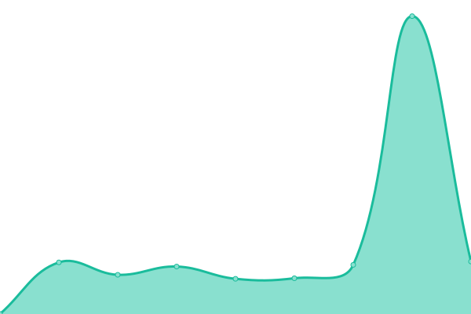
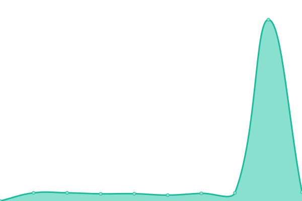

# [📈 Live Status](https://status.tr1cky.au): <!--live status--> **🟧 Partial outage**

This repository contains the open-source uptime monitor and status page for [Robert Dorward](https://tr1cky.au), powered by [Upptime](https://github.com/upptime/upptime).

<!--start: status pages-->
<!-- This summary is generated by Upptime (https://github.com/upptime/upptime) -->
<!-- Do not edit this manually, your changes will be overwritten -->
<!-- prettier-ignore -->
| URL | Status | History | Response Time | Uptime |
| --- | ------ | ------- | ------------- | ------ |
|  [ZLTAC Main Site](https://zltac.com.au) | 🟩 Up | [zltac-main-site.yml](https://github.com/DorwardTech/status/commits/HEAD/history/zltac-main-site.yml) | 

 218ms
     
 | 

<a href="https://status.tr1cky.au/history/zltac-main-site">100.00%</a>
    

|  [TORN 5](https://torn.lasersports.au) | 🟩 Up | [torn-5.yml](https://github.com/DorwardTech/status/commits/HEAD/history/torn-5.yml) | 

 849ms
     
 | 

<a href="https://status.tr1cky.au/history/torn-5">100.00%</a>
    

|  [Laser Sports Australasia](https://lasersports.au) | 🟩 Up | [laser-sports-australasia.yml](https://github.com/DorwardTech/status/commits/HEAD/history/laser-sports-australasia.yml) | 

 1170ms
     
 | 

<a href="https://status.tr1cky.au/history/laser-sports-australasia">100.00%</a>
    

|  [Laser Sports Archive](https://archive.lasersports.au) | 🟥 Down | [laser-sports-archive.yml](https://github.com/DorwardTech/status/commits/HEAD/history/laser-sports-archive.yml) | 

 0ms
     
 | 

<a href="https://status.tr1cky.au/history/laser-sports-archive">0.00%</a>
    

|  [Top End Laser Sports Association](https://nt.lasersports.au) | 🟩 Up | [top-end-laser-sports-association.yml](https://github.com/DorwardTech/status/commits/HEAD/history/top-end-laser-sports-association.yml) | 

 1143ms
     
 | 

<a href="https://status.tr1cky.au/history/top-end-laser-sports-association">100.00%</a>
    

|  [Tr1cky Home Page](https://tr1cky.au) | 🟩 Up | [tr1cky-home-page.yml](https://github.com/DorwardTech/status/commits/HEAD/history/tr1cky-home-page.yml) | 

 1142ms
     
 | 

<a href="https://status.tr1cky.au/history/tr1cky-home-page">100.00%</a>
    

<!--end: status pages-->

[**Visit our status website →**](https://status.tr1cky.au)

## 📄 License

- Powered by: [Upptime](https://github.com/upptime/upptime)
- Code: [MIT](./LICENSE) © [Robert Dorward](https://tr1cky.au)
- Data in the `./history` directory: [Open Database License](https://opendatacommons.org/licenses/odbl/1-0/)
